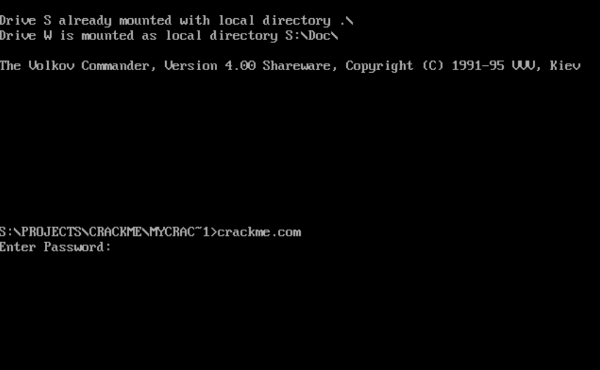
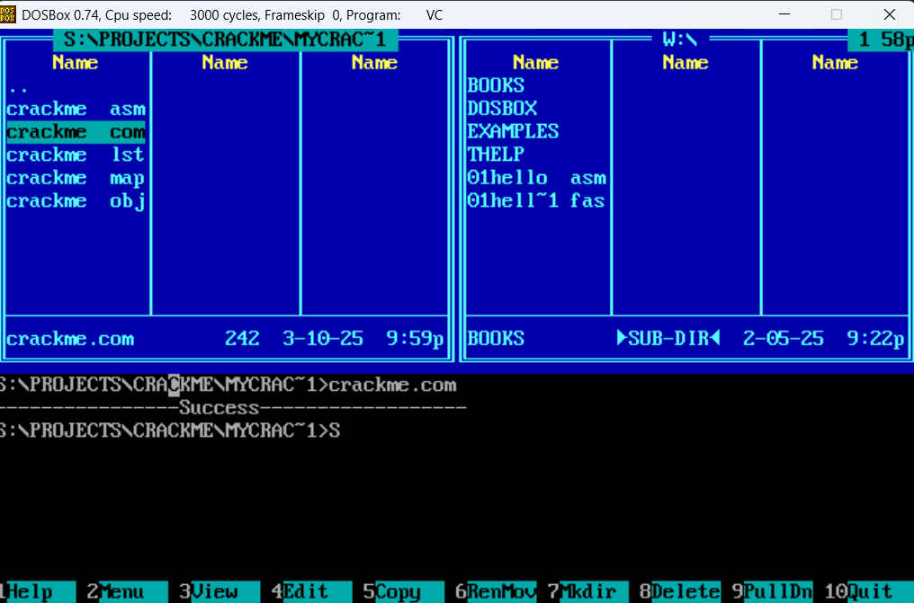
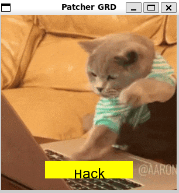
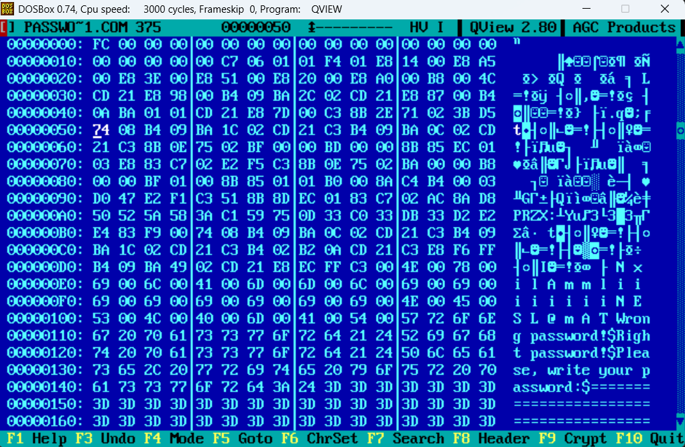
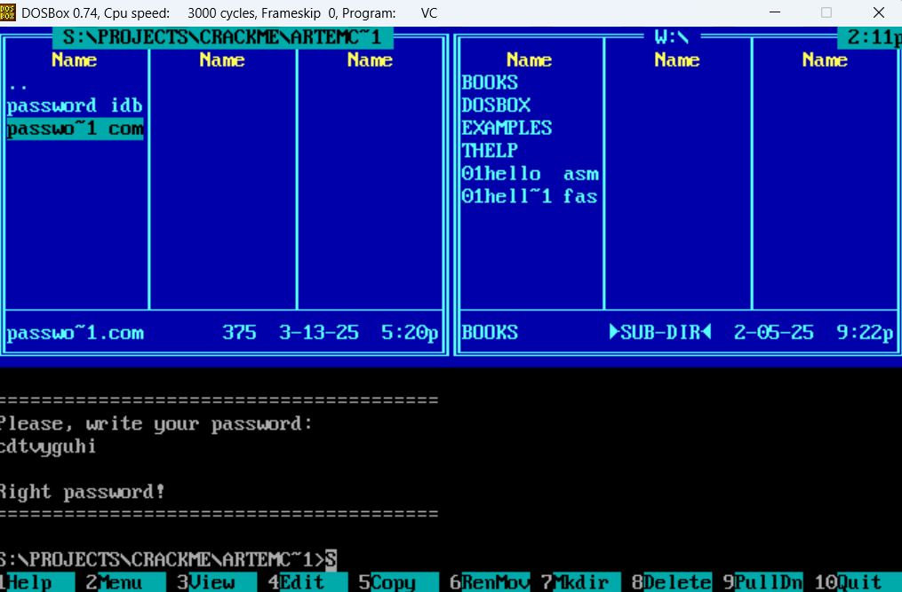
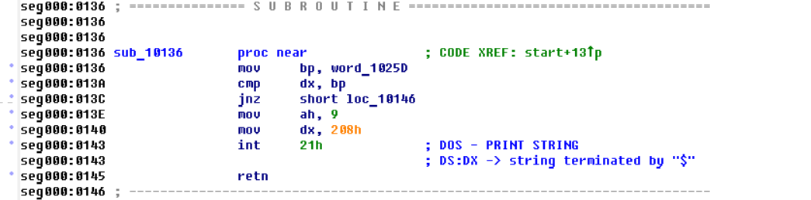
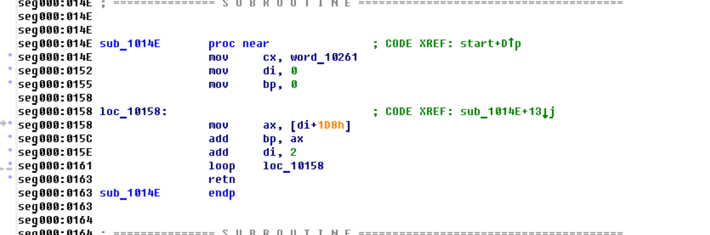

# CrackMe

## Используемые инструменты
1. Код CrackMe был реализован на x86-assembly, запауск файлов выполнялся через dosbox. Для отладки использовался turbo debugger.
2. Дизассемблирование .com файла выполнялось при помощи IDA.
3. Код для patcher был реализован на C с использование графической библиотеки SFML.
4. Запуск программ осуществяется через makefile

## Постановка задачи

В данной работе было предложено реализовать программу на ассемблере, написаной под DOS. Программа которая принимает пароль пользователя и проверяет его.
К тому же была задача обменятся .com файлом с другом для последующего взлома: подобрать такой пароль котрый не совпадает с исходным, но тем не менее система защиты его пропускает и вторая часть : реализовать программу меняющую исполняемый файл так чтобы любой введенный пароль был верным.

## Моя версия

Пользователю прпедлагается ввести пароль с приветсвенной фразой: Enter Password.
Пароль хранится в виде хэша, что делает невозможным в результате применения дизассемблера узнать настоящий пароль. В программе вводимый пользователем пароль пересчитывается в хэш и сравнивается с хэшом настоящего пароля.

### Уязвимости

1. Простая: при введении вместо второго символа @ пароль считается автоматически верным.
2. Сложная: (связана с переполением буффера) буффер имеет размер 13 символов, но пользователь может ввести максимум 40 символов в связи с этим данные следующие за буффером пароля затираются. Тем самым пользователь может подобрать пароль такой что перые 13 символов будут пааролем, а следующие будут затирать хэщ настоящего пароля.

## Удачная проверка

## Неудачная попытка

## Patcher

Программа на С и с использованием графической библиотеки SFML.

При нажатии на клавишу "Hack" запускается программа replace_byte.cpp которая меняет бит в исполяемом файле.

При запсуке нажатии кнопки отмеченный байт меняется с "75" на "75", иными словами с jne на je в результате любой введеный пароль будет верным.

## Другие уязвимости которые я нашел

1. Проверка пароля происходит по сумме ASCII кодов, что дает возможность зняю их сумму подобрать пароль с такой же суммой, коорый не являясь верным будет проходить проверку.

2. Переполнее буффера: есть возможность затереть весь код, что сделает программу не дееспособной.

